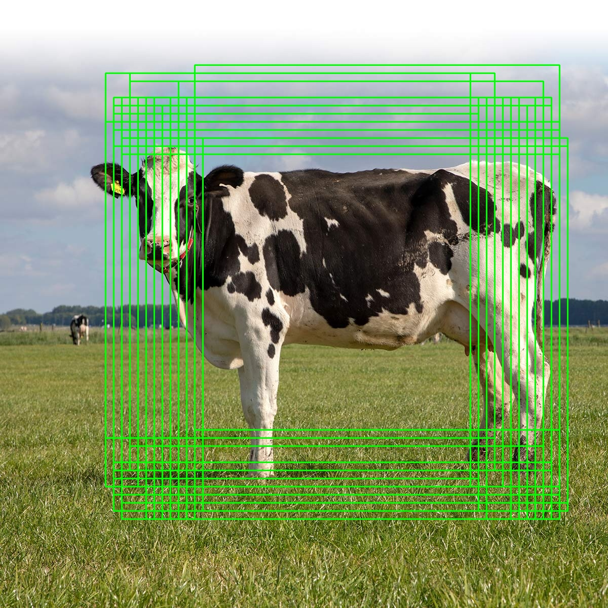
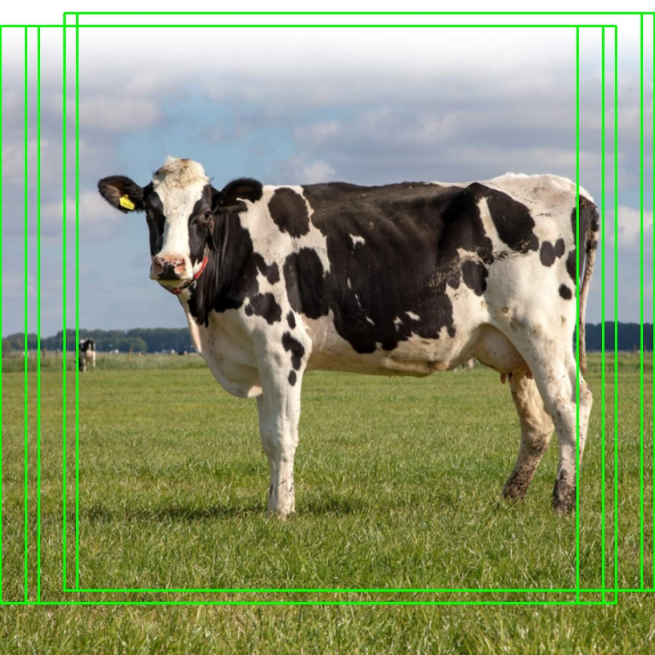
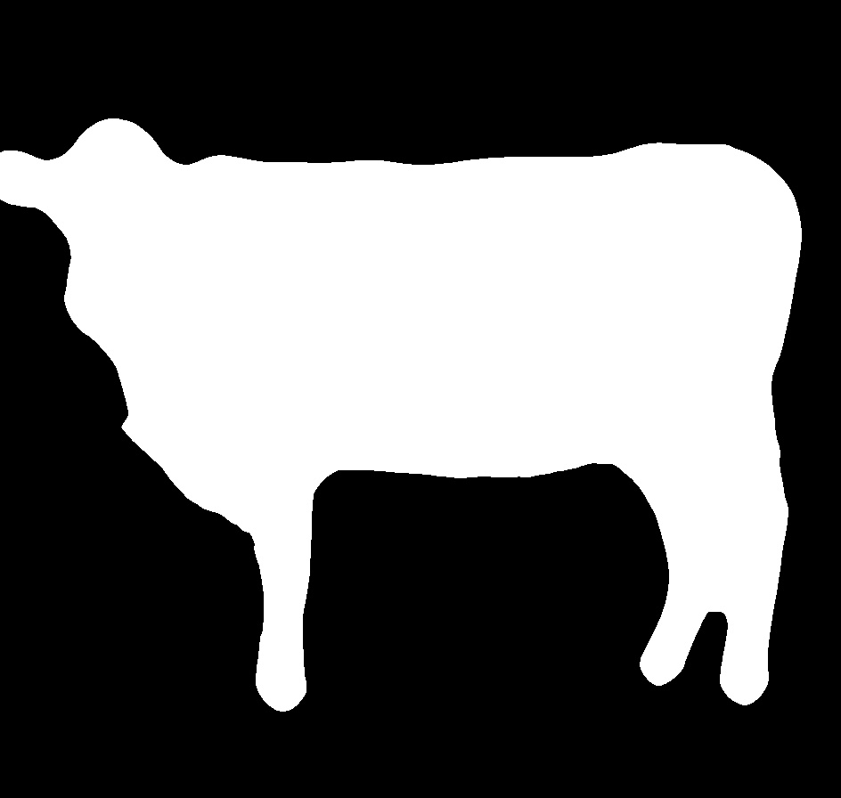

# Object Detection and Segmentation using Histogram of Oriented Gradients (HOG) and Template Matching from Scratch

`Disclaimer: This project is part of the course work for the Numerical Methods course. Therefore, it is not intended to be used for commercial purposes, only for learning and concept proving purposes. As an additional note, the code is not optimized for performance, especially concerning the time complexity due to the forbidden use of most libraries, specifically numpy.`

## Introduction

This project aims to implement a simple object detection and segmentation algorithm, with the case study of detecting and segmenting a **cow** from an image. Utilizing the Histogram of Oriented Gradients (HOG) and Template Matching algorithms for object detection and color segmentation for object segmentation. The project is implemented in Python 3.7.3.

## Methods

### Detection

#### Histogram of Oriented Gradients (HOG)

The Histogram of Oriented Gradients (HOG) is a feature descriptor used in computer vision and image processing for the purpose of object detection. The technique counts occurrences of gradient orientation in localized portions of an image. This method is similar to that of edge orientation histograms, scale-invariant feature transform descriptors, and shape contexts, but differs in that it is computed on a dense grid of uniformly spaced cells and uses overlapping local contrast normalization for improved accuracy.

Extracting the HOG features from an image is done by the following steps:

1. Convert the image to grayscale.
2. Blur the image using a Gaussian filter.
3. Resize the image to a (64, 128) image, since the HOG algorithm works best with this size.
4. Compute the gradient of the image using the Finite Difference method.
5. Compute the magnitude and orientation of the gradient.

Below is an example of the Magnitude and Orientation of the gradient of an image:

| Magnitude                            | Orientation                              |
| ------------------------------------ | ---------------------------------------- |
|  |  |

6. Divide the image into cells of size (8, 8).
7. Compute the histogram of the gradient orientations for each cell.
8. Normalize the histogram of each cell using the L2-norm.

#### Template Matching

Template matching is a technique in digital image processing for finding small parts of an image which match a template image. It can be used in manufacturing as a part of quality control, a way to navigate a mobile robot, or as a way to detect edges in images. The algorithm is fairly simple and straightforward, but it can be slow for large images.

#### Multi-scale Sliding Window

Combining the HOG and Template Matching algorithms using multi-scale sliding window, we can detect the object in the image and segment it out. In this experiment, we use:

- Image scale ratio of 1.1x.
- Window size of (720, 720).
- Window stride of (16, 16).

The algorithm is as follows:

1. Compute the HOG of the template image.
2. Slide the window over the target image.
3. Compute the HOG of the current window.
4. Compute the distance between the HOG of the template and the HOG of the current window.
5. Find the IOU of the last detected window and the current detected window.
6. If the IOU is greater than the threshold, then the current window is assumed to be the object and recorded.
7. Repeat steps 2-6 until the multi-scale pyramid is exhausted.

Below is an example of the detected windows from the multi-scale sliding window algorithm, based on ratio of the image size:

| 1.0x Scale                | 1.3ex Scale                              | 1.46x Scale                               |
| ------------------------- | ---------------------------------------- | ----------------------------------------- |
|  |  |  |

#### Finding the Detected Object

After the multi-scale sliding window algorithm is done, we will have a list of detected windows. We can then find the intersection of all the detected normalized windows from all the scales to find the detected object.

| Intersection of Detected Windows           | Detected Object                    |
| ------------------------------------------ | ---------------------------------- |
|  |  |

### Segmentation

`Note: The segmentation algorithm is not properly implemented for the use case of other images. It is only implemented for the use case of the given image.`

#### Color Segmentation

Color segmentation is a technique in digital image processing for finding parts of an image which match a color. On this project which is the case study of detecting and segmenting a cow, we can use color segmentation to segment the detected object from the image. The algorithm is as follows:

1. Get the cropped image of the detected object from the image.
2. Convert the image to HSV color space.
3. Use the Hue channel only to segment the image, since it shows the best contrast between the cow and the background.
4. Apply Gaussian blur to the image to remove noise.
5. Apply thresholding to the image to remove the background.
6. Invert the image to get the foreground properly.
7. Apply morphological operations closing to the image to remove the holes in the cow.
8. Apply median blur to the image to remove noise.

Below is the result of each step of the algorithm:

| Original Image             | Cropped Image                    | Hue Channel                  | Gaussian Blur                      |
| -------------------------- | -------------------------------- | ---------------------------- | ---------------------------------- |
|  |  |  |  |

| Thresholding                             | Inversion                             | Morphological Closing                | Median Blur                       |
| ---------------------------------------- | ------------------------------------- | ------------------------------------ | --------------------------------- |
|  |  |  |  |

## Results

| Original Image             | Detected Object                    | Cropped Image                    | Segmented Image                      |
| -------------------------- | ---------------------------------- | -------------------------------- | ------------------------------------ |
|  |  |  |  |

## Conclusion

The project was a success, the object was detected and segmented from the image. However, both the detection and segmentation algorithms are not robust enough to be used in real-world applications. The detection algorithm is not robust enough to detect objects in images with complex backgrounds, and the segmentation algorithm is not robust enough to segment the detected object from the image. The segmentation algorithm is also not robust enough to be used for other images, it is only implemented for the use case of the given image.
